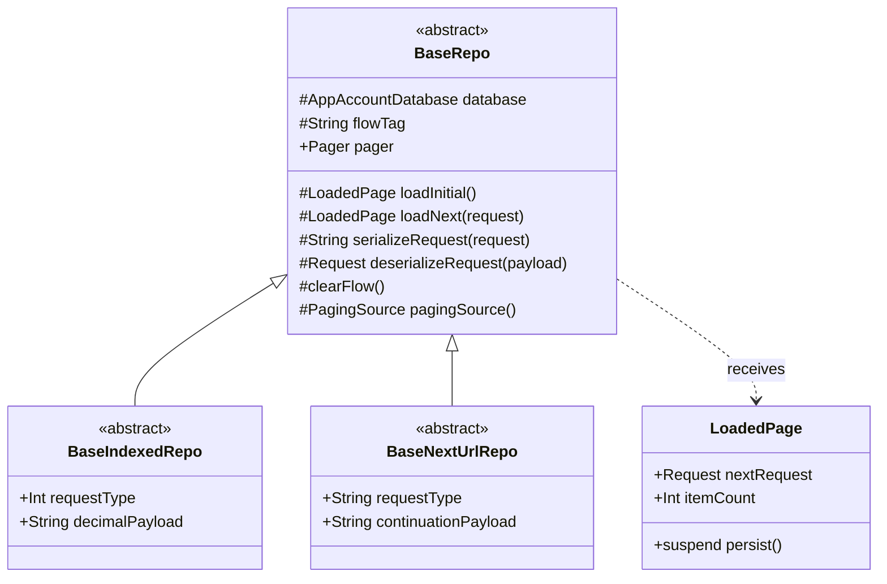
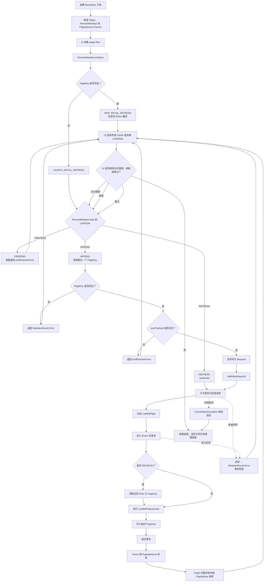
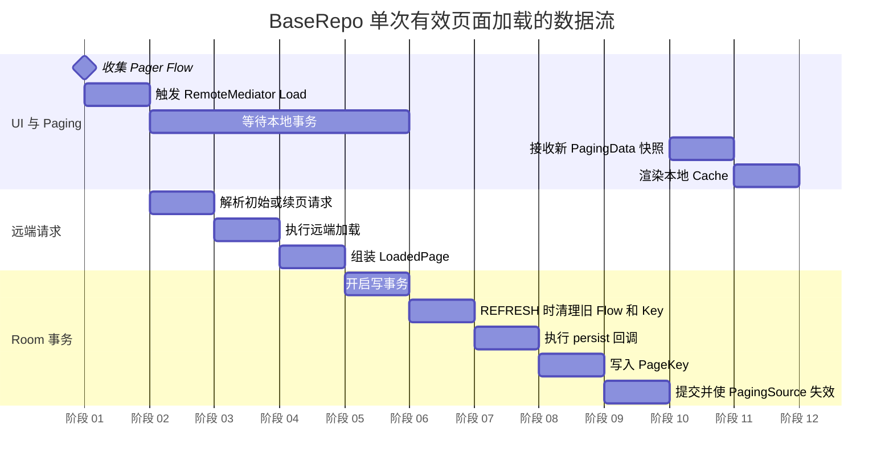

# BaseRepo 生命周期与数据流

## 定位

`BaseRepo<Request, Cache>` 是本地优先、仅向后加载的分页仓库基础设施。

它负责协调：

- AndroidX Paging 的 `Pager` 与 `RemoteMediator`。
- 远端分页请求。
- Room 写事务。
- Flow 顺序表。
- `PageKey` 分页状态。
- Room `PagingSource` 与 UI 数据更新。

UI 始终读取 Room，不直接展示远端响应。远端数据必须先完成本地事务，随后由 Room 使 `PagingSource` 失效并向 UI 发布新快照。

实现位置：

- `sharedUI/src/commonMain/kotlin/top/kagg886/pmf/ui/repository/base.kt`

## 类型关系



| 类型 | `Request` | `PageKey.nextPayload` |
| --- | --- | --- |
| `BaseIndexedRepo` | `Int` | 十进制数字字符串 |
| `BaseNextUrlRepo` | `String` | 原样保存的 continuation 字符串 |

BaseRepo 不感知具体的远端 Bean、本地实体或 UI 展示类型。子仓库通过抽象方法和 `LoadedPage.persist` 提供这些业务能力。

## 生命周期流程图



该图覆盖一个仓库实例从创建到 UI 停止收集的完整生命周期。Paging 可以在同一实例内多次触发 REFRESH、APPEND 或 retry，因此 `Load` 到 `Render` 是可重复循环。

## 数据流甘特图

下面的横轴表示先后阶段，不表示真实耗时。相同日期开始的任务表示可以重叠或由不同组件并行观察。



核心因果关系是：

```text
远端请求完成
  → LoadedPage 创建
  → 本地事务完整提交
  → PagingSource 失效
  → UI 收到新快照
```

远端请求成功但本地事务失败时，不会产生新的 UI 快照；事务内的部分写入也不会残留。

## 初始化阶段

`RemoteMediator.initialize()` 查询：

```kotlin
database.pageKeyDao().last(flowTag)
```

- 不存在 `PageKey`：返回 `LAUNCH_INITIAL_REFRESH`。
- 存在 `PageKey`：返回 `SKIP_INITIAL_REFRESH`，优先展示本地缓存。

`flowTag` 是一条逻辑数据流的稳定身份。不同内容类型、筛选条件或排序规则不得复用同一个 `flowTag`，否则会错误共享分页状态。

## REFRESH 生命周期

REFRESH 的执行顺序：

1. 在事务外调用 `loadInitial()`。
2. 子仓库完成远端请求并返回 `LoadedPage`。
3. BaseRepo 开启 Room 写事务。
4. 清理当前 `flowTag` 的旧 Flow 行。
5. 清理当前 `flowTag` 的旧 `PageKey`。
6. 执行 `LoadedPage.persist`。
7. 写入本地页码为 1 的新 `PageKey`。
8. 提交事务并由 Room 使查询失效。

旧缓存只在新响应已经成功返回后才开始清理。远端请求失败不会提前删除当前 Flow。

## APPEND 生命周期

APPEND 首先读取最后一个 `PageKey`：

```text
没有 PageKey
  → 状态异常，返回 MediatorResult.Error

PageKey.nextPayload == null
  → 分页已经结束，不再请求远端

PageKey.nextPayload != null
  → deserializeRequest
  → loadNext
  → 提交 LoadedPage
```

APPEND 不清理旧 Flow。子仓库应将新 Flow 行追加到末尾，使本地查询能够保持跨页顺序。

## LoadedPage 生命周期

BaseRepo 通过 `LoadedPage` 接收：

```text
nextRequest  下一次 APPEND 使用的请求；null 表示结束
itemCount    本次远端响应数量，仅用于诊断日志
persist      在 BaseRepo 的 Room 事务中执行的挂起回调
```

远端请求和持久化被有意拆开：

- 网络请求在事务外执行，避免长时间占用数据库写事务。
- `persist` 在事务内执行，保证缓存、Flow 和 `PageKey` 原子提交。
- BaseRepo 无需增加网络 Bean 泛型，也无需了解具体表结构。

## 本地读取生命周期

`pagingSourceFactory` 每次创建新的 Room `PagingSource<Int, Cache>`。

1. UI 收集 `Pager.flow`。
2. PagingSource 从本地表与 Flow 顺序表查询数据。
3. 写事务修改相关表后，Room 将当前 PagingSource 标记为失效。
4. Pager 调用 factory 创建新的 PagingSource。
5. 新 PagingSource 查询提交后的完整数据库状态。
6. UI 收到新的 `PagingData` generation。

这保证 UI 不会观察到事务中间状态。

## PREPEND、结束、失败与取消

- `PREPEND`：仓库只向后加载，直接返回 `endOfPaginationReached = true`。
- 正常结束：`LoadedPage.nextRequest == null`，对应 `PageKey.nextPayload == null`。
- 空页但存在 continuation：提交空页并保存 continuation，允许下一次 APPEND 继续。
- 普通异常：转换为 `MediatorResult.Error`，UI 可以调用 retry。
- 事务异常：Room 回滚缓存、Flow 和 `PageKey` 的全部变更。
- 协程取消：`CancellationException` 继续抛出，不伪装成加载失败。

## 接入指南

接入新数据流时，默认只需要根据远端分页协议选择：

- 数字页码：继承 `BaseIndexedRepo<DisplayedCache>`。
- continuation/next URL：继承 `BaseNextUrlRepo<DisplayedCache>`。

其中 `DisplayedCache` 是 Room `PagingSource` 返回并最终交给 UI 的本地展示类型，不是远端 Bean。

### 两种仓库都必须提供的能力

无论选择哪一种基类，都必须实现以下函数：

```kotlin
protected override suspend fun loadInitial(): LoadedPage<Request>

protected override suspend fun loadNext(
    request: Request,
): LoadedPage<Request>

protected override suspend fun clearFlow()

protected override fun pagingSource(): PagingSource<Int, DisplayedCache>
```

各函数职责：

| 函数 | 必须完成的工作 |
| --- | --- |
| `loadInitial()` | 请求第一批远端数据，并返回 `LoadedPage` |
| `loadNext(request)` | 使用 BaseRepo 恢复出的 continuation 请求下一批数据 |
| `clearFlow()` | 只删除当前 `flowTag` 的 Flow 顺序行 |
| `pagingSource()` | 返回按 Flow 顺序查询的 Room `PagingSource` |

`serializeRequest()` 和 `deserializeRequest()` 不需要实现：

- `BaseIndexedRepo` 已固定使用 `Int.toString()` / `String.toInt()`。
- `BaseNextUrlRepo` 已固定原样保存和恢复字符串。

### 选择 BaseIndexedRepo

适用于 `page=1, 2, 3...` 或者可以从页码计算 offset 的接口。

推荐模板：

```kotlin
abstract class ExampleIndexedRepo(
    database: AppAccountDatabase,
    flowTag: String,
    private val networkPageSize: Int = 30,
) : BaseIndexedRepo<ExampleCacheDisplayed>(
    database = database,
    flowTag = flowTag,
    pageSize = networkPageSize,
) {
    /** 只负责调用远端接口，不进行数据库写入。 */
    protected abstract suspend fun request(index: Int): List<ExampleBean>

    /** 如果接口有独立的结束标识，可覆盖这里的判断。 */
    protected open fun endOfPaginationReached(
        index: Int,
        items: List<ExampleBean>,
    ): Boolean = items.size < networkPageSize

    final override suspend fun loadInitial(): LoadedPage<Int> =
        load(FIRST_INDEX)

    final override suspend fun loadNext(request: Int): LoadedPage<Int> =
        load(request)

    final override suspend fun clearFlow() {
        database.exampleFlowDao().clean(flowTag)
    }

    final override fun pagingSource(): PagingSource<Int, ExampleCacheDisplayed> =
        database.exampleFlowDao().query(flowTag)

    private suspend fun load(index: Int): LoadedPage<Int> {
        // 网络请求发生在 Room 事务外。
        val items = request(index)
        val endReached = endOfPaginationReached(index, items)
        val nextIndex = if (endReached) null else index + 1

        return loadedPage(
            nextRequest = nextIndex,
            itemCount = items.size,
        ) {
            // 该回调由 BaseRepo 放入 Room 写事务执行。
            database.persistItems(flowTag, items)
        }
    }

    private companion object {
        const val FIRST_INDEX = 1
    }
}
```

后来使用该仓库时，只需实现远端请求：

```kotlin
val repo = object : ExampleIndexedRepo(database, "example:recommend") {
    override suspend fun request(index: Int): List<ExampleBean> =
        client.getExamples(page = index)
}
```

### 选择 BaseNextUrlRepo

适用于远端响应同时返回当前数据和下一页 continuation 的接口。

假设远端响应为：

```kotlin
data class ExampleResult(
    val items: List<ExampleBean>,
    val nextUrl: String?,
)
```

推荐模板：

```kotlin
abstract class ExampleNextUrlRepo(
    database: AppAccountDatabase,
    flowTag: String,
    pageSize: Int = 30,
) : BaseNextUrlRepo<ExampleCacheDisplayed>(
    database = database,
    flowTag = flowTag,
    pageSize = pageSize,
) {
    /** 请求第一页，不进行数据库写入。 */
    protected abstract suspend fun requestInitial(): ExampleResult

    /** nextUrl 由 BaseRepo 从 PageKey 恢复。 */
    protected abstract suspend fun requestNext(nextUrl: String): ExampleResult

    final override suspend fun loadInitial(): LoadedPage<String> =
        requestInitial().toLoadedPage()

    final override suspend fun loadNext(request: String): LoadedPage<String> =
        requestNext(request).toLoadedPage()

    final override suspend fun clearFlow() {
        database.exampleFlowDao().clean(flowTag)
    }

    final override fun pagingSource(): PagingSource<Int, ExampleCacheDisplayed> =
        database.exampleFlowDao().query(flowTag)

    private fun ExampleResult.toLoadedPage(): LoadedPage<String> =
        loadedPage(
            nextRequest = nextUrl,
            itemCount = items.size,
        ) {
            // 该回调由 BaseRepo 放入 Room 写事务执行。
            database.persistItems(flowTag, items)
        }
}
```

后来使用该仓库时，只需实现两个远端请求：

```kotlin
val repo = object : ExampleNextUrlRepo(database, "example:recommend") {
    override suspend fun requestInitial(): ExampleResult =
        client.getRecommendedExamples()

    override suspend fun requestNext(nextUrl: String): ExampleResult =
        client.getExamplesNext(nextUrl)
}
```

不得把完整 `nextUrl` 写入日志。若需要关联一次请求，只记录字符串长度、哈希或不含敏感参数的摘要。

### persist 回调必须实现什么

`LoadedPage.persist` 运行在 BaseRepo 创建的 Room 写事务中。它至少应完成：

1. 将远端 Bean 转成本地实体。
2. 先写被外键引用的实体。
3. 再写主实体和关联表。
4. 按远端响应顺序追加当前 `flowTag` 的 Flow 行。

Bean → Entity 转换必须放在实体伴生对象中：

```kotlin
val entity = ExampleCache.fromBean(bean)
```

不要在 persist 中：

- 发起网络请求。
- 开启嵌套的独立事务。
- 清理其他 `flowTag`。
- 直接向 UI 发布远端 Bean。
- 捕获异常后假装写入成功。

### 接入检查清单

- [ ] 选择了正确的 `BaseIndexedRepo` 或 `BaseNextUrlRepo`。
- [ ] `flowTag` 能唯一表达内容类型、筛选条件和排序规则。
- [ ] `loadInitial()` 和 `loadNext()` 只在事务外请求网络。
- [ ] `LoadedPage.nextRequest == null` 能正确表示分页结束。
- [ ] `clearFlow()` 只删除当前 Flow。
- [ ] `pagingSource()` 使用稳定顺序查询。
- [ ] persist 按外键依赖顺序写入实体、关联表和 Flow。
- [ ] UI 使用的是本地 `DisplayedCache`。
- [ ] 日志覆盖入口、响应摘要、持久化结果、fallback、取消和失败。
- [ ] 日志未包含完整 continuation、token、Cookie 或用户隐私数据。
